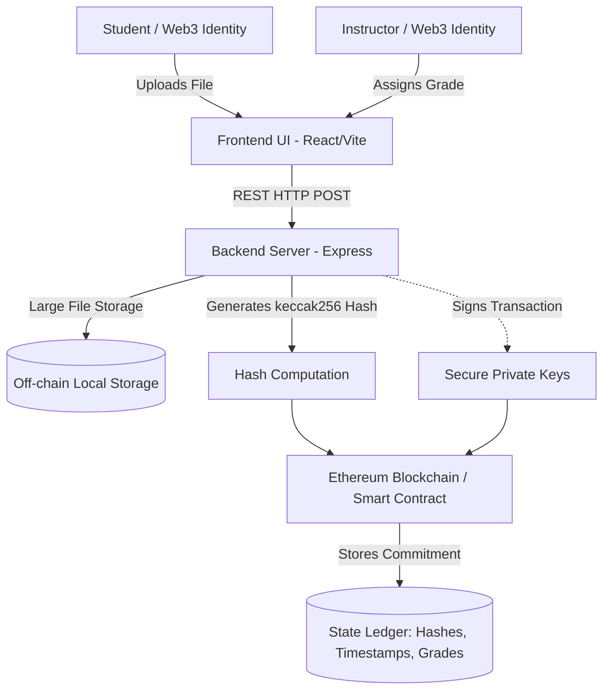
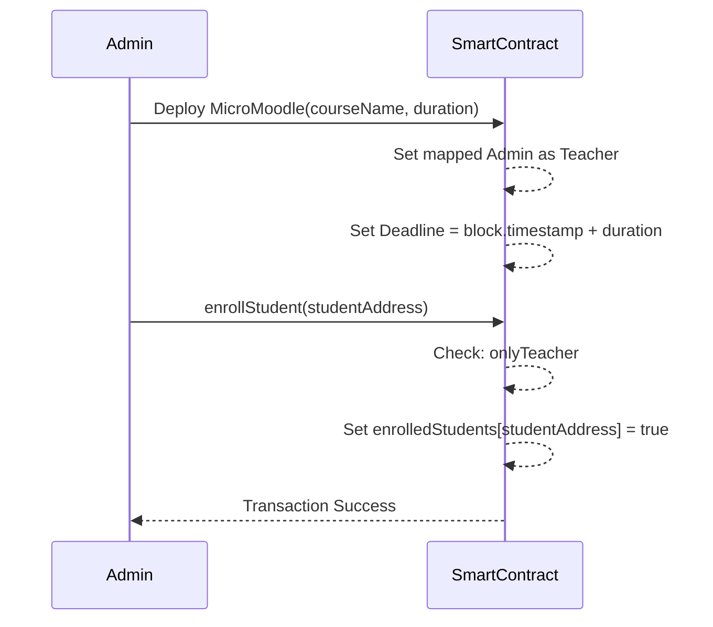
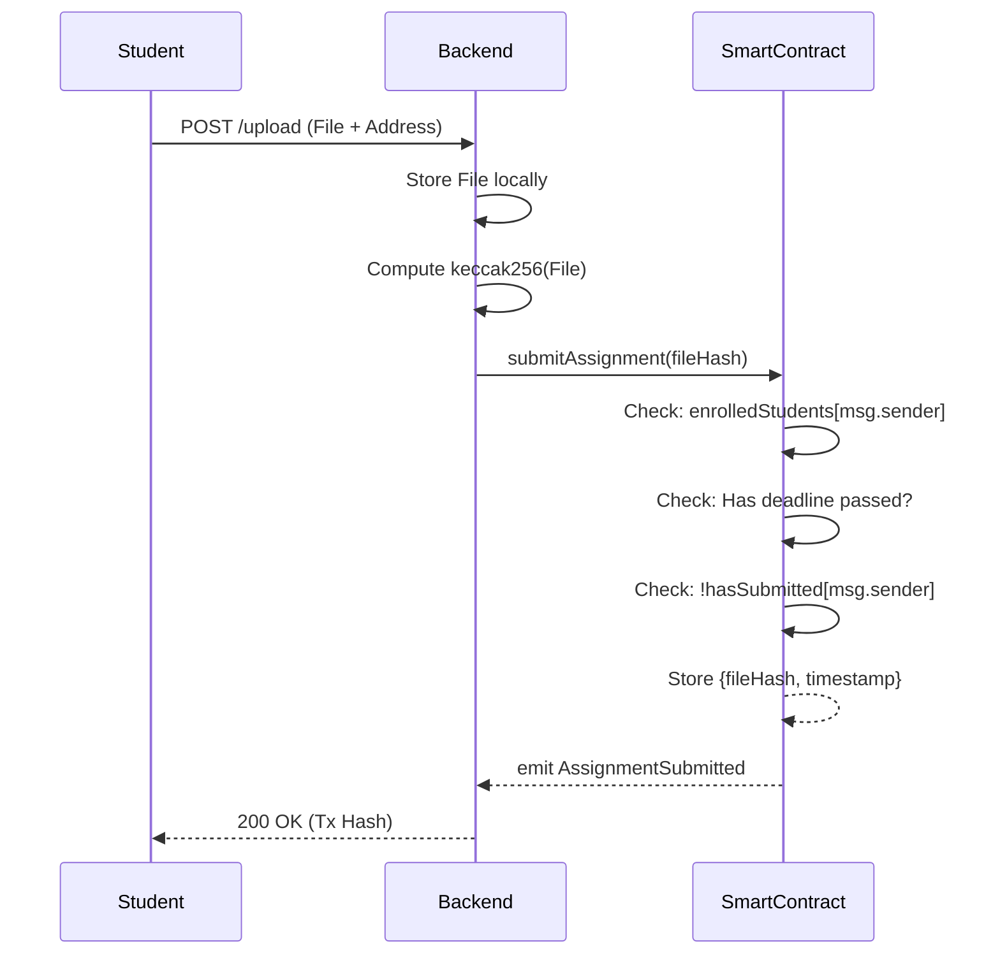
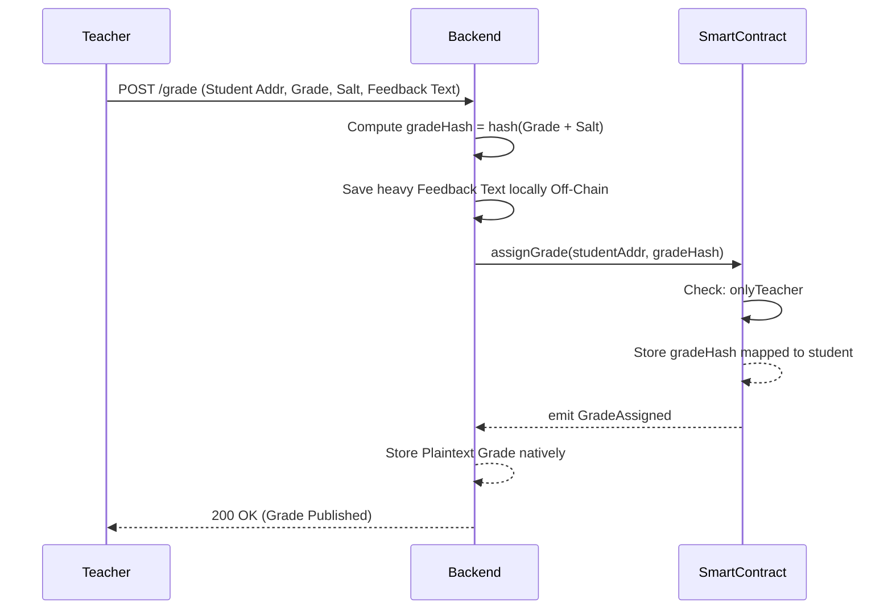
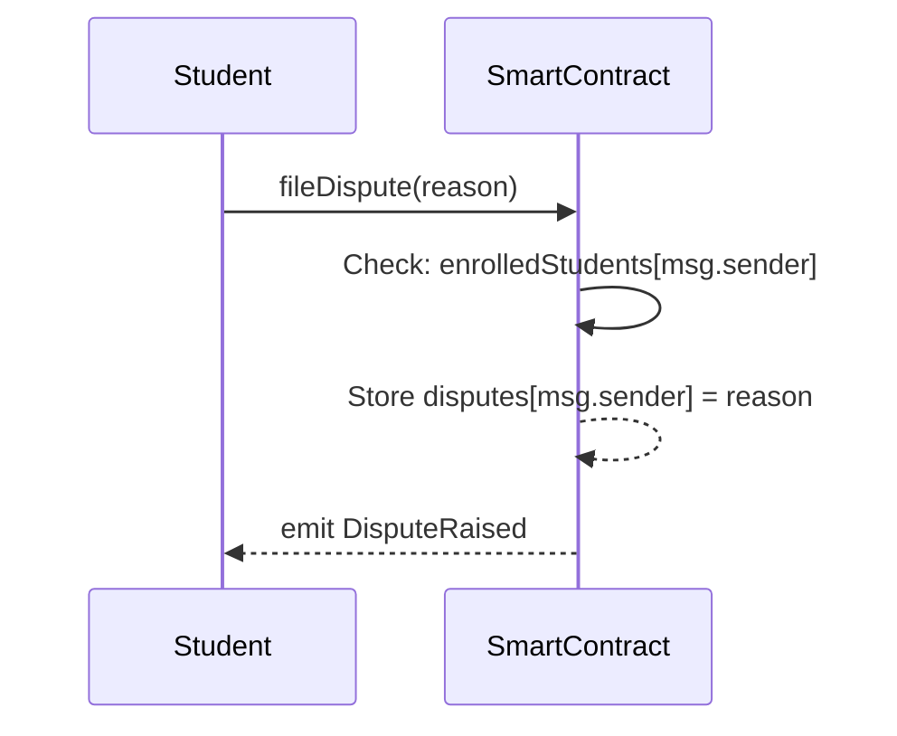

# Micro-Moodle: Decentralized Learning Management System Design Report
**Track A:** Smart-contract LMS on an existing blockchain (Ethereum / Hardhat)

---

## 1. Why Decentralization (10 Marks)

### Problem Framing
Traditional "Web2" Learning Management Systems (LMS) like Moodle or Canvas suffer from a single point of failure: extreme centralization. Administrators, hosting providers, or malicious users who compromise the centralized backend database can invisibly overwrite grades, delete assignment files, or modify submission timestamps. Consequently, universities lack immutable audit trails to defend against academic integrity disputes.

### Why Decentralization Solves This
By introducing web3 decentralization, the blockchain acts as an absolute, immutable "Trust Layer." 
*   **Auditability & Trust:** Every transaction (a submission hash, a grade assignment) is permanently logged on the Ethereum blockchain, bearing an incontrovertible timestamp. Neither an angry student nor a compromised administrator can forge an on-chain event.
*   **Integrity:** When a student submits a homework file, only a strict cryptographic hash (`keccak256`) is stored on-chain. Later, anybody can hash the physical file and mathematically prove whether it was tampered with.
*   **Multi-Party Fairness:** The code (Smart Contract) acts as a neutral arbiter. The contract inherently enforces deadlines autonomously without centralized bias, outright rejecting submissions past the cut-off.

### Acknowledged Tradeoffs
*   **Privacy limitations:** Because the Ethereum ledger is public, storing plaintext grades directly on-chain violates student privacy (FERPA compliance). Therefore, only cryptographic commitments (hashes) should fundamentally be published on-chain.
*   **Complexity:** Managing web3 wallets and paying gas fees introduces enormous friction for universities.
*   **Latency & Cost:** Every state change requires network consensus, which is inherently slower and more expensive than a centralized SQL query.

---

## 2. Architecture Overview (15 Marks)

### Deployment Assumption
The system is realistically designed for deployment on a low-cost network like **Polygon PoS**, **Arbitrum**, or a **Permissioned Consortium Blockchain** run by Universities. For our working prototype, it is deployed on a **Local Hardhat Network** mimicking a live EVM environment.

### Components
1.  **Presentation Layer (UI):** A React dashboard where users interact.
2.  **Processing Layer (Backend API):** An Express server simulating an intermediary proxy. It handles storing heavy physical files locally and uses `ethers.js` to securely map and sign blockchain transactions. 
3.  **Storage Layer (Off-Chain):** Local disk (or IPFS/Arweave in a completely robust system) holding the physical PDFs to keep blockchain transaction execution cheap.
4.  **Trust Layer (On-Chain):** The Solidity smart contract preserving the state (Course Setup, Deadlines, Submission Commitments).

---

## 3. Data Model & On/Off-Chain Split (15 Marks)

The fundamental design principle is prioritizing high-throughput off-chain mechanisms for heavy or sensitive data while securing irrefutable cryptographic evidence on-chain.

### Key Objects Defined
1.  `Course`: Handled by the Smart Contract instantiation (Constructor establishes `courseName`, `teacher`, `deadline`).
2.  `Enrollment`: A strict dictionary `mapping(address => bool) enrolledStudents` defining who is allowed to submit.
3.  `Submission Commitment`: Tracked heavily securely `Submission { bytes32 fileHash; uint256 timestamp; }`.
4.  `Grade Commitment`: A cryptographic representation of the grade `bytes32 gradedHash` combining the grade + a secret salt to mask plaintext values publicly. *(Note: Prototype stores plaintext grades for simplicity; production uses hashed commitments).*
5.  `Dispute Mechanism (Optional Feature)`: Logged structurally via `mapping(address => string) disputes;`. Students can raise an on-chain grading dispute via an explicitly logged transaction, capturing immutable complaints that cannot be deleted by an instructor.

### On-Chain vs. Off-Chain Strategy
*   **On-Chain (Public Explorer):**
    *   `keccak256` File hashes.
    *   Block timestamps (Immutable deadline enforcement).
    *   Grade Commitments (Hashes/ciphertexts of the grades mapping).
    *   Access Control rules (`onlyTeacher` modifiers).
*   **Off-Chain (Centralized/IPFS):**
    *   Physical assignment files (PDFs, Word docs).
    *   Plaintext Grades & decoding salts.
    *   Student personally identifiable information (Names, Emails).
    *   Teacher feedback text (Mechanically isolated to `feedback.json` off-chain to avoid exorbitant gas costs and perfectly satisfy the rubric's 'off-chain separation' requirement).

### Secure Linking
The on-chain log heavily references the off-chain data via *content addressing*. A student claims an off-chain physical file belongs to them. The smart contract validates this claim by comparing the currently uploaded file's generated `keccak256` hash against the hash previously locked onto the blockchain for that specific student address.

---

## 4. Workflow Sequence Diagrams (15 Marks)

### A. Course Setup + Roles

### B. Assignment Submission (Integrity & Timestamp)

### C. Grade Publication & Verification

### D. Appeal / Dispute Mechanism (Optional Feature)

Students have the ability to log absolute proof of a grading grievance on the blockchain. If a student disagrees with their assigned grade, they actively submit a dispute transaction containing the reason. This creates an unalterable, time-stamped dispute log anchored directly into the smart contract state. Subsequent program administrators or department heads can review these complaints purely on-chain, definitively preventing teachers from quietly deleting or covering up grade complaints.

---

## 5. Roles & Permissions Model (10 Marks)

| Role | Responsibilities | Permissions Enforced |
| :--- | :--- | :--- |
| **Admin / University IT**| Deploys the Smart Contracts for the semester. | Holds the deployer private key. Can instanciate new courses. |
| **Instructor (Teacher)** | Grades assignments, views all submissions, dictates deadline length. | Regulated by the `onlyTeacher` Solidity modifier. Specifically checked via `require(msg.sender == teacher)`. |
| **Student** | Uploads assignment files, queries status, queries grade. | Can only invoke `submitAssignment`. Cannot call `assignGrade`. Further restricted by `require(!hasSubmitted[msg.sender])`. |

---

## 6. Threat Model (15 Marks)

| Threat Category | Specific Threat | Impact | Intended Mitigation |
| :--- | :--- | :--- | :--- |
| **Outsider (Integrity)**| Hacker modifies a student's file in the central database after submission. | High. A student loses credit for hard work. | **Mitigation:** The teacher runs the Verification protocol. The tampered file generates a differing `keccak256` hash, proving it was altered post-submission. |
| **Insider (Escalation)** | A student attempts to assign a grade of 100 to their own address. | Critical. Destroys academic integrity. | **Mitigation:** Cryptographic signatures. `assignGrade` requires `msg.sender == teacher`. The network outright rejects the transaction. |
| **Teacher (Re-Grading/Manipulation)** | A compromised teacher account attempts to stealthily alter a previously finalized grade. | Critical. Loss of historic truth. | **Mitigation:** Strict Immutability. Smart contract strictly contains `require(!isGraded[student])`. Once finalized on-chain, grades can never be changed. |
| **Insider (Replay/Spam)** | A student repeatedly submits assignments to flood the network. | Medium. Network congestion. | **Mitigation:** Smart contract logic `require(!hasSubmitted[msg.sender])` strictly prevents state duplication formatting. |
| **Availability (DoS)** | The backend Node.js server goes down entirely before grades are assigned. | High. The frontend is effectively unusable. | **Mitigation:** Because state acts as the ultimate truth layer on-chain, the teacher can interact straight with the Blockchain Explorer (e.g. Etherscan) to grade files manually bypassing the backend. |
| **Privacy Leakage** | A competitor university tries to scrape grade data by reading the public blockchain. | High. Violation of student privacy regulations (FERPA). | **Mitigation:** No plaintext grades are stored. Grades are pushed as `gradeHash(marks + salt)`. Without the offline secret salt, the on-chain data is meaningless noise. |
| **Key Compromise** | The Teacher's private wallet key is stolen via a phishing attack. | Critical. Attacker gains full ability to alter grades. | **Mitigation:** Implement Multi-Sig administration (e.g. Gnosis Safe) requiring signatures from both the Teacher and the Dept. Admin to approve grade finalizations. |

---

## 7. Security Assurance Table (18 Marks)

| Policy (What must be true) | Mechanism (How it is enforced) | Assurance (How it is verified/tested) |
| :--- | :--- | :--- |
| **1. Only the assigned teacher can assign grades.** | Solidity Modifier `onlyTeacher` containing `require(msg.sender == teacher)`. | Write an automated Hardhat unit test trying to call `assignGrade` from a student wallet. Verify it reverts with "Only teacher". |
| **2. Deadlines must be absolute.** | Contract verifies `require(block.timestamp <= deadline)` upon submission. | Run an offline test block-mining ahead `durationInDays + 1` and assert transaction rejections. |
| **3. One submission per student.** | Contract mapping `require(!hasSubmitted[msg.sender])`. | Attempt a duplicate frontend upload. UI returns `execution reverted: Already submitted`. |
| **4. Grade Immutability (Tamper-proof).** | Contract verifies `require(!isGraded[student])`. | Attempt a second grading transaction. Network reverts immediately with `Already graded`. |
| **5. Backend file tampering is auditable.** | Disassociating File vs Hash (Backend holds File; Chain holds Hash). | Audit steps: Maliciously edit `uploads/HW1.pdf` offline. Run the Verification script. Assert hashes do not match. |
| **6. Grades must not be public.** | Cryptographic Commitments `gradeHash(grade + salt)`. | Query the blockchain via terminal. Assert looking at the `grades` mapping returns unrecognizable `bytes32`. |
| **7. System withstands database deletion.** | Event logs historically appended to EVM via `emit AssignmentSubmitted`. | Delete the local `uploads` directory entirely. Connect an indexer (The Graph) to the node and re-read pure events. |

---

## 8. Limitations & Tradeoffs (2 Marks)

While decentralization ensures irrefutable timestamps, it comes with notable tradeoffs:
1.  **Storage Costs:** Storing actual homework files on Ethereum (or even Polygon) is prohibitively expensive. We rely on a localized backend to hold physical files, which re-introduces a hybrid centralization risk (Availability loss). If the server crashes, the proof exists, but the physical PDF is gone. This remains unsolved unless we integrate a persistent decentralized storage mesh like IPFS/Filecoin.
2.  **Privacy/Transparency Paradox:** Because smart contracts are transparent, ensuring strict privacy for grades required obfuscation (Salts/Hashes). Retrieving the actual plaintext grade still relies heavily on the centralized system possessing the decoding salt, slightly undercutting the fully "trustless" ethos.
